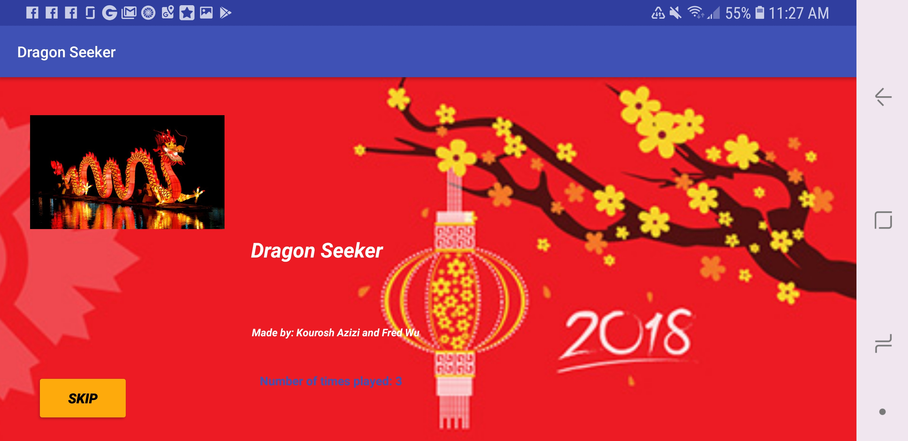
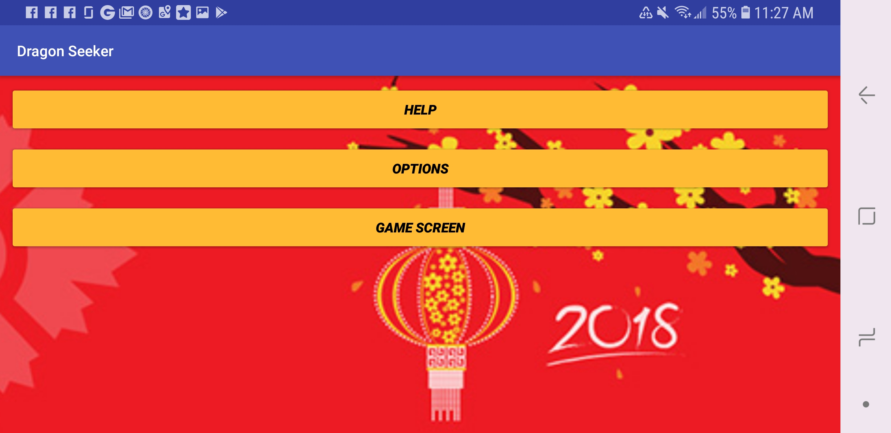
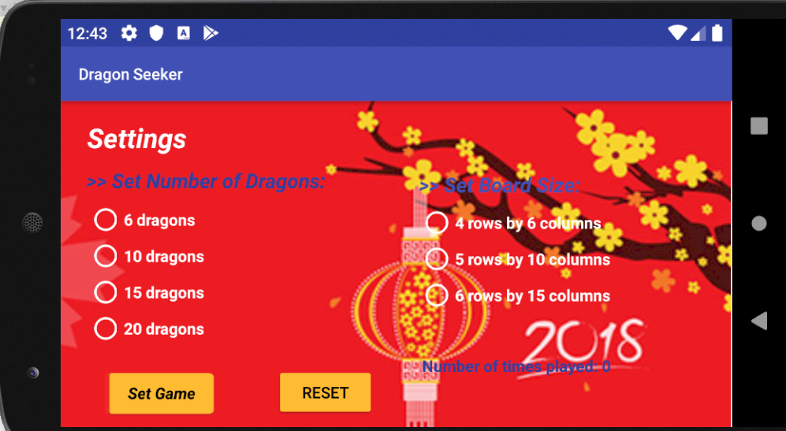
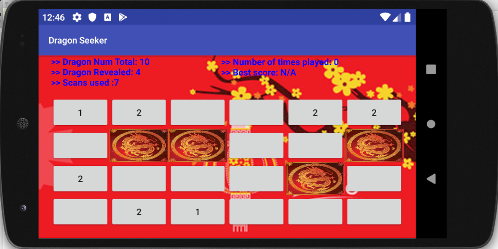

# board-game-app
Developed an Android application to create a board game for Chinese New Year.

### Motivation:
Android app development.

### Objective:
1. Use the given information on the board to figure out where the object (e.g., dragon) is.
2. Beat your best score on the next attempt.

### Limitations:
The best score and the number of attempts are only saved locally.

### Future improvements:
1. Create user account.
2. Save user data on cloud.

